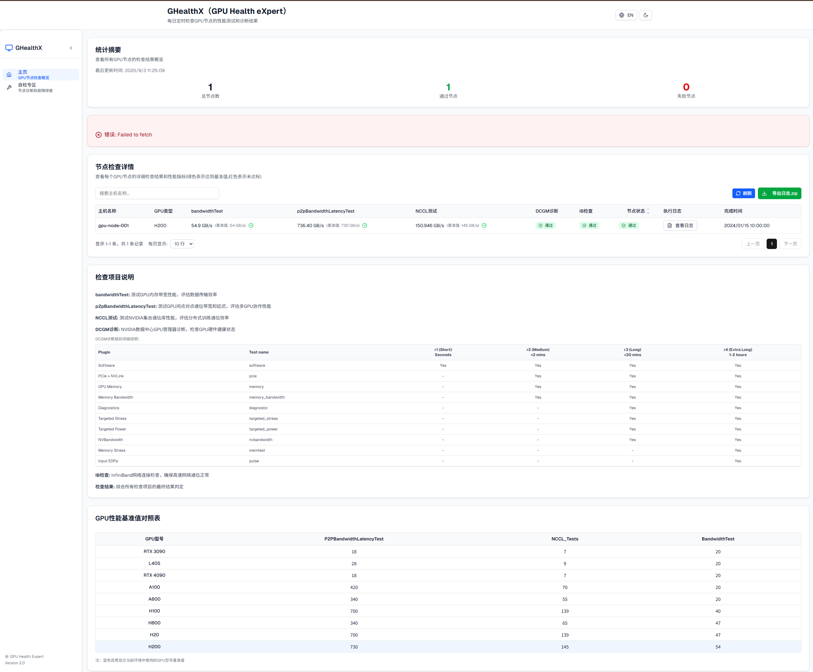
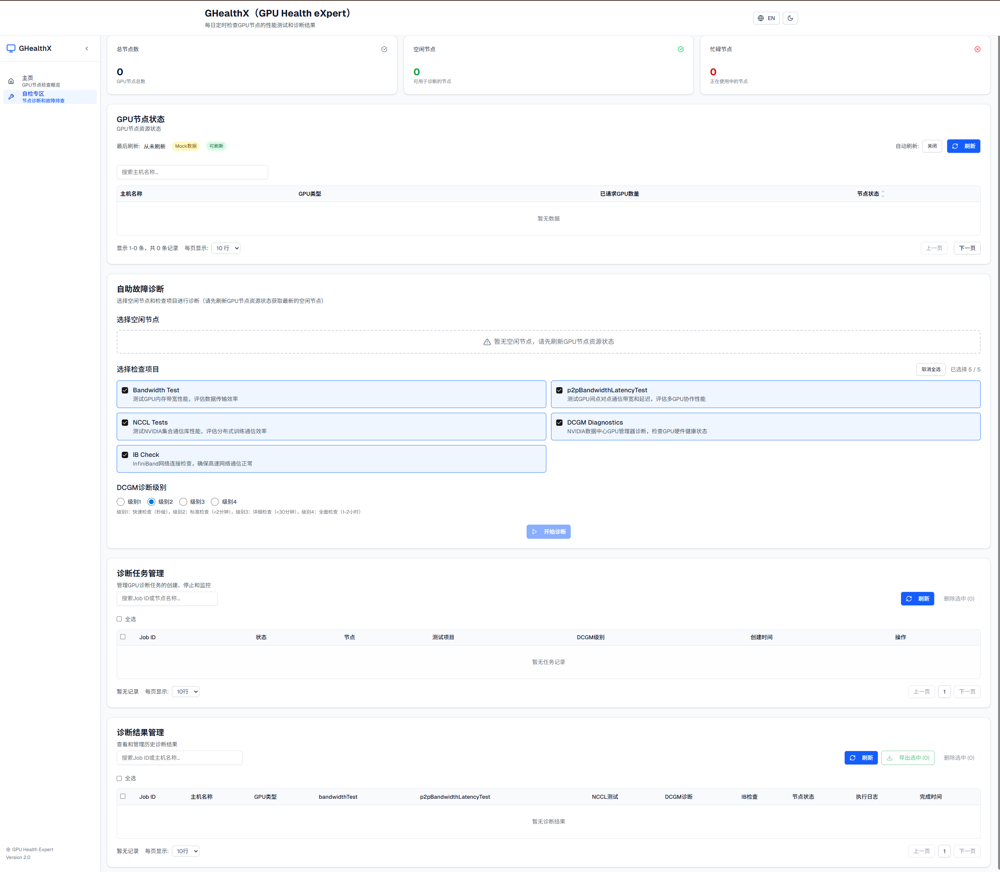
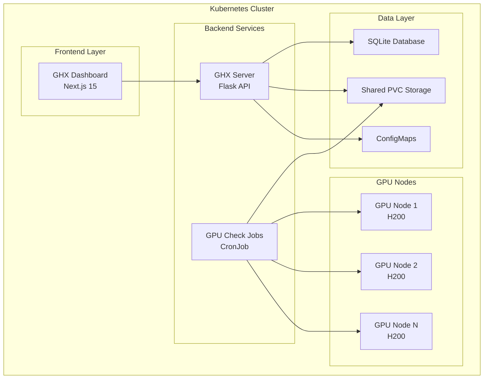
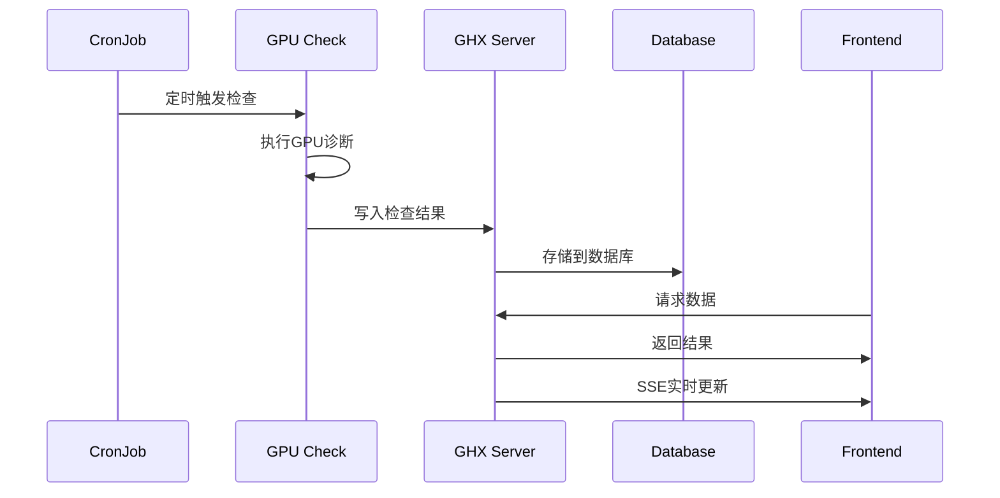

# GHX (GPU Health Expert) - GPU健康专家系统

<div align="center">


**一个基于Kubernetes的智能GPU集群健康监控与诊断系统**

[](https://github.com/your-repo/ghx)
[](LICENSE)
[](https://kubernetes.io/)
[](https://python.org/)
[](https://nextjs.org/)

[English](README_EN.md) | [中文](README.md)

---

### 🤖 AI孵化项目

本项目由 **[Cursor](https://cursor.sh/)** 和 **[v0](https://v0.dev/)** 两个AI工具联合孵化开发

- **Cursor**: 负责后端架构设计、API开发、数据库优化、Kubernetes集成等核心功能实现
- **v0**: 负责前端UI设计、组件开发、用户体验优化、响应式布局等界面实现

**AI协作开发**: 通过AI工具的强大能力，实现了从概念到产品的快速迭代，展现了AI辅助开发的新模式

</div>

## 📋 目录

- [项目概述](#-项目概述)
- [系统架构](#-系统架构)
- [核心功能](#-核心功能)
- [技术栈](#-技术栈)
- [快速开始](#-快速开始)
- [部署指南](#-部署指南)
- [API文档](#-api文档)
- [故障排查](#-故障排查)
- [更新日志](#-更新日志)
- [贡献指南](#-贡献指南)

## 🎯 项目概述

GHX (GPU Health Expert) 是一个企业级的GPU集群健康监控与诊断系统，专为大规模GPU计算环境设计。系统采用微服务架构，提供自动化GPU诊断、实时监控、智能调度和可视化展示功能。

### ✨ 核心特性

- 🔍 **智能诊断**: 多维度GPU健康检查（性能、硬件、网络）
- 📊 **实时监控**: Web仪表板实时显示集群状态
- 🤖 **智能调度**: 自动识别空闲节点，避免资源冲突
- 📈 **性能分析**: 详细的性能基准测试和趋势分析
- 🌐 **国际化**: 支持中英文界面切换
- 🎨 **主题切换**: 明暗主题自适应
- 📱 **响应式设计**: 适配各种屏幕尺寸

### 🖼️ 系统展示




## 🏗️ 系统架构

### 整体架构图



### 组件说明

| 组件 | 技术栈 | 功能描述 |
|------|--------|----------|
| **GHX Dashboard** | Next.js 15, React 19, TypeScript | 现代化Web界面，支持主题切换和国际化 |
| **GHX Server** | Python 3.9+, Flask, SQLite | 统一后端服务，提供REST API和SSE |
| **GPU Check Jobs** | Python, CUDA, DCGM | 自动化GPU诊断和性能测试 |
| **Shared Storage** | PVC, ConfigMap | 数据持久化和配置管理 |

### 数据流



## 🚀 核心功能

### 1. 智能GPU诊断

- **性能测试**: 带宽测试、P2P通信、NCCL性能
- **健康检查**: DCGM诊断、IB网络检查
- **基准对比**: 与标准基准值自动对比
- **多GPU支持**: RTX3090, L40S, A100, H100, H200等

### 2. 实时监控仪表板

- **集群概览**: 节点状态、通过率统计
- **详细视图**: 单节点详细检查结果
- **历史追溯**: 完整的检查历史记录
- **执行日志**: 详细的诊断过程日志

### 3. 智能调度系统

- **资源感知**: 实时监控GPU使用情况
- **动态调整**: 根据集群状态自动优化调度
- **零冲突**: 避免与生产任务产生资源竞争
- **高可用**: 提高集群整体资源利用率

### 4. 用户体验优化

- **主题切换**: 明暗主题自适应
- **语言切换**: 中英文界面支持
- **响应式设计**: 适配各种设备
- **分页优化**: 智能分页和搜索功能

## 🛠️ 技术栈

### 后端技术

- **Python 3.9+**: 主要开发语言
- **Flask**: Web框架
- **SQLite**: 轻量级数据库
- **Kubernetes Client**: 集群管理
- **CUDA 12.9**: GPU计算
- **DCGM**: GPU诊断工具

### 前端技术

- **Next.js 15**: React框架
- **React 19**: UI库
- **TypeScript**: 类型安全
- **Tailwind CSS**: 样式框架
- **Radix UI**: 组件库
- **Server-Sent Events**: 实时通信

### 基础设施

- **Kubernetes**: 容器编排
- **Docker**: 容器化
- **Helm**: 包管理
- **PVC**: 持久化存储
- **ConfigMap**: 配置管理

## 🚀 快速开始

### 环境要求

- Kubernetes 1.20+
- NVIDIA GPU驱动和CUDA工具包
- Docker 20.10+
- Helm 3.0+

### 一键部署

```bash
# 1. 克隆项目
git clone <repository-url>
cd infraops

# 2. 创建命名空间
kubectl create namespace gpu-health-expert

# 3. 创建kubeconfig secret
kubectl create secret generic gpu-health-expert-kubeconfig \
  --from-file=/root/.kube/config \
  -n gpu-health-expert

# 4. 使用Helm部署
helm install ghx ./helm/gpu-health-expert -n gpu-health-expert

# 5. 验证部署
kubectl get pods -n gpu-health-expert
```

### 访问系统

- **前端界面**: http://your-cluster-ip:31033
- **后端API**: http://your-cluster-ip:31005

## 📖 部署指南

### 使用Helm部署（推荐）

```bash
# 安装
helm install ghx ./helm/gpu-health-expert -n gpu-health-expert

# 升级
helm upgrade ghx ./helm/gpu-health-expert -n gpu-health-expert

# 卸载
helm uninstall ghx -n gpu-health-expert
```

### CORS配置

项目支持简化的CORS配置，只需要配置 `CORS_ORIGINS` 环境变量：

```bash
# 环境变量配置（多个地址用逗号分隔）
# 默认已包含localhost地址，只需添加额外地址
export CORS_ORIGINS="http://your-domain.com:31033,http://your-server-ip:31033"
```

**注意**：如果不设置环境变量，系统将使用默认的开发环境地址。


### 动态资源配置

项目支持动态获取GPU和RDMA资源信息，通过 `kubectl-resource-view` 工具自动检测集群中的实际资源：

```bash
# 获取GPU资源信息
curl http://your-server:31005/api/gpu-inspection/gpu-resource-info

# 获取RDMA资源信息
curl http://your-server:31005/api/gpu-inspection/rdma-resource-info
```


### 使用YAML部署

```bash
# 部署所有组件
kubectl apply -f ghx.yaml

# 验证部署
kubectl get all -n gpu-health-expert
```

### 配置说明

#### Helm Values配置

```yaml
# 命名空间
namespace: gpu-health-expert

# 后端服务配置
ghxServer:
  image: kang2023/ghx-server:v1.0.0
  port: 5000
  nodePort: 31005
  tolerations:
    - operator: "Exists"
      effect: "NoSchedule"
  nodeSelector:
    ghx: enable

# 前端配置
dashboard:
  image: kang2023/ghx-dashboard:v1.0.0
  port: 3000
  nodePort: 31033

# GPU基准值配置
benchmarks:
  config:
    H200: { p2p: 730, nccl: 145, bw: 54 }
    H100: { p2p: 700, nccl: 139, bw: 40 }
    A100: { p2p: 420, nccl: 70, bw: 20 }
```

## 📚 API文档

### 核心API接口

#### 诊断结果API

| 接口 | 方法 | 功能 | 示例 |
|------|------|------|------|
| `/api/gpu-inspection/results` | GET | 获取诊断结果列表 | `GET /api/gpu-inspection/results?page=1&size=20` |
| `/api/gpu-inspection/results/job/{job_id}` | GET | 获取特定Job结果 | `GET /api/gpu-inspection/results/job/manual-123` |
| `/api/gpu-inspection/create-job` | POST | 创建手动诊断Job | `POST /api/gpu-inspection/create-job` |
| `/api/gpu-inspection/stop-job` | POST | 停止诊断Job | `POST /api/gpu-inspection/stop-job` |

#### 实时通信API

| 接口 | 方法 | 功能 | 说明 |
|------|------|------|------|
| `/api/gpu-inspection/job-status-stream` | GET | SSE状态流 | 实时Job状态更新 |
| `/api/gpu-inspection/check-job-status/{job_id}` | GET | 检查Job状态 | 单次状态查询 |

#### 系统管理API

| 接口 | 方法 | 功能 | 说明 |
|------|------|------|------|
| `/api/gpu-inspection/health` | GET | 健康检查 | 服务状态检查 |
| `/api/gpu-inspection/status` | GET | 系统状态 | 详细状态信息 |
| `/api/rate-limit/stats` | GET | 频率限制统计 | 限流信息 |

### 响应格式

```json
{
  "success": true,
  "data": {
    "id": 1,
    "jobId": "manual-1234567890-abc123",
    "nodeName": "hd03-gpu2-0055",
    "gpuType": "H200",
    "inspectionResult": "Pass",
    "performancePass": true,
    "executionTime": "2025-01-15T10:30:00Z",
    "executionLog": "详细的执行日志...",
    "testResults": {
      "bandwidthTest": "55.1 GB/s",
      "p2pBandwidthLatencyTest": "730.2 GB/s",
      "ncclTests": "145.3 GB/s",
      "dcgmDiag": "Pass",
      "ibCheck": "Pass"
    },
    "benchmarkData": {
      "p2p": 730,
      "nccl": 145,
      "bw": 54
    }
  },
  "timestamp": "2025-01-15T10:30:00Z"
}
```

## 🔧 故障排查

### 常见问题

#### 1. 部署问题

```bash
# 检查Pod状态
kubectl get pods -n gpu-health-expert

# 查看Pod日志
kubectl logs -f deployment/ghx-server -n gpu-health-expert

# 检查服务状态
kubectl get svc -n gpu-health-expert
```

#### 2. GPU检查失败

```bash
# 查看CronJob状态
kubectl get cronjob -n gpu-health-expert

# 查看Job日志
kubectl logs -f job/ghx-cronjob-xxx -n gpu-health-expert

# 检查节点资源
kubectl describe node <node-name>
```

#### 3. 数据库问题

```bash
# 检查数据库文件
kubectl exec -it deployment/ghx-server -n gpu-health-expert -- ls -la /shared/

# 查看数据库内容
kubectl exec -it deployment/ghx-server -n gpu-health-expert -- sqlite3 /shared/gpu_inspection.db ".tables"
```

#### 4. 网络问题

```bash
# 检查PVC状态
kubectl get pvc -n gpu-health-expert

# 测试网络连接
kubectl exec -it deployment/ghx-server -n gpu-health-expert -- curl http://localhost:5000/api/gpu-inspection/health
```

### 调试命令

```bash
# 查看所有资源
kubectl get all -n gpu-health-expert

# 查看配置
kubectl get configmap -n gpu-health-expert
kubectl get secret -n gpu-health-expert

# 查看事件
kubectl get events -n gpu-health-expert --sort-by='.lastTimestamp'

# 进入Pod调试
kubectl exec -it deployment/ghx-server -n gpu-health-expert -- /bin/bash
```

## 📈 更新日志

### v1.0.0 (2025-09-03) - 初始版本

#### 🎉 架构重构
- **统一服务**: 合并`gpu_collector_service`和`gpu_cli`为`ghx_server`
- **现代化前端**: 升级到Next.js 15和React 19
- **智能调度**: 实现Kubernetes Informer机制
- **SSE通信**: 实时状态更新和通知

#### ✨ 新功能
- **手动诊断**: 支持按需创建GPU诊断任务
- **实时监控**: Job状态实时更新和进度显示
- **智能缓存**: 5秒缓存机制，提升性能
- **频率限制**: 智能API限流保护

#### 🔧 技术改进
- **数据库优化**: 添加唯一约束和索引
- **错误处理**: 完善的异常处理和日志记录
- **代码重构**: 模块化设计，提高可维护性


## 🤝 贡献指南

我们欢迎所有形式的贡献！

### 开发流程

1. **Fork项目**
   ```bash
   git clone <your-fork-url>
   ```

2. **创建功能分支**
   ```bash
   git checkout -b feature/your-feature-name
   ```

3. **开发测试**
   ```bash
   # 后端开发
   python ghx_server.py
   
   # 前端开发
   cd ghx-dashboard
   npm install
   npm run dev
   ```

4. **提交代码**
   ```bash
   git add .
   git commit -m "feat: add your feature"
   git push origin feature/your-feature-name
   ```

5. **创建Pull Request**

### 代码规范

- **Python**: 遵循PEP 8规范
- **TypeScript**: 使用ESLint和Prettier
- **提交信息**: 使用Conventional Commits格式
- **测试**: 确保新功能有对应的测试用例

### 问题报告

- 使用GitHub Issues报告Bug
- 提供详细的复现步骤
- 包含系统环境信息

## 🙏 特别鸣谢

本项目基于以下优秀的开源项目构建，特此感谢：

### 核心依赖项目

- **[kubectl-resource-view](https://github.com/bryant-rh/kubectl-resource-view)** - Kubernetes资源使用情况查看工具
  - 我们的Fork版本：[kubectl-resource-view](https://github.com/FanKang2021/kubectl-resource-view) - 修改支持了非标准GPU资源标签

- **[nccl-tests](https://github.com/coreweave/nccl-tests)** - NCCL性能测试工具集
  - 用于GPU间通信性能基准测试

- **[gpu-burn](https://github.com/wilicc/gpu-burn)** - GPU压力测试工具
  - 用于GPU负载测试和稳定性验证

- **[cuda-samples](https://github.com/NVIDIA/cuda-samples)** - NVIDIA CUDA示例代码
  - 提供了GPU编程和性能测试的参考实现

### 致谢

感谢这些开源项目的维护者和贡献者，他们的工作为GHX项目提供了坚实的基础。我们致力于在开源社区中回馈和贡献，让GPU集群管理变得更加简单和智能。

## 📄 许可证

本项目采用 MIT 许可证 - 查看 [LICENSE](LICENSE) 文件了解详情。

## 📞 联系方式

- **项目Issues**: [GitHub Issues](https://github.com/FanKang2021/GPU-Health-eXpert/issues)
- **邮箱**: 1459767542@qq.com
- **文档**: [项目Wiki](https://github.com/FanKang2021/GPU-Health-eXpert/wiki/)
- **QQ群**: 扫描下方二维码加入技术交流群

<div align="center">


**扫码加入GHX技术交流群，获取最新资讯和技术支持**

</div>

---

<div align="center">

**GHX - 让GPU集群管理更简单、更智能**

Made with ❤️ by the GHX Team

</div>