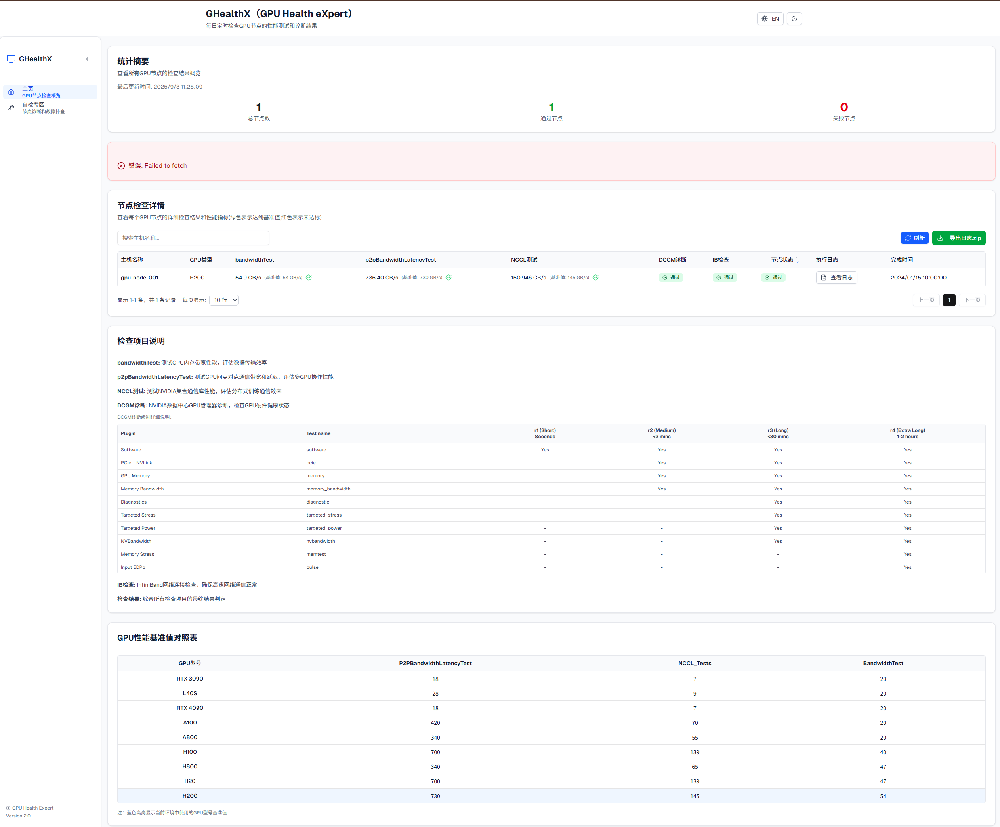
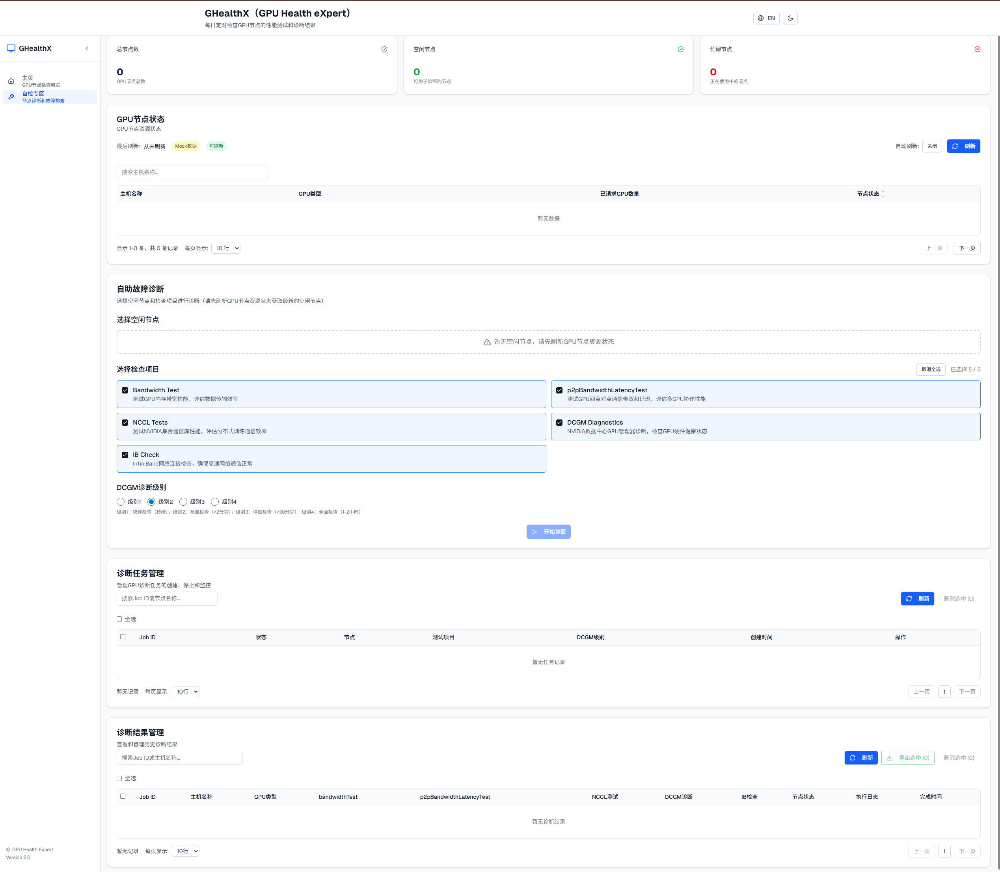

# GHX (GPU Health Expert) - GPU Health Monitoring System

<div align="center">


**An intelligent GPU cluster health monitoring and diagnostic system based on Kubernetes**

[](https://github.com/your-repo/ghx)
[](LICENSE)
[](https://kubernetes.io/)
[](https://python.org/)
[](https://nextjs.org/)

[English](README_EN.md) | [中文](README.md)

---

### 🤖 AI-Incubated Project

This project is jointly incubated and developed by **[Cursor](https://cursor.sh/)** and **[v0](https://v0.dev/)** AI tools

- **Cursor**: Responsible for backend architecture design, API development, database optimization, Kubernetes integration, and core functionality implementation
- **v0**: Responsible for frontend UI design, component development, user experience optimization, responsive layout, and interface implementation

**AI Collaborative Development**: Through the powerful capabilities of AI tools, we achieved rapid iteration from concept to product, showcasing a new paradigm of AI-assisted development

</div>

## 📋 Table of Contents

- [Project Overview](#-project-overview)
- [System Architecture](#-system-architecture)
- [Core Features](#-core-features)
- [Technology Stack](#-technology-stack)
- [Quick Start](#-quick-start)
- [Deployment Guide](#-deployment-guide)
- [API Documentation](#-api-documentation)
- [Troubleshooting](#-troubleshooting)
- [Changelog](#-changelog)
- [Contributing](#-contributing)

## 🎯 Project Overview

GHX (GPU Health Expert) is an enterprise-grade GPU cluster health monitoring and diagnostic system designed for large-scale GPU computing environments. The system adopts a microservices architecture, providing automated GPU diagnostics, real-time monitoring, intelligent scheduling, and visualization capabilities.

### ✨ Key Features

- 🔍 **Intelligent Diagnostics**: Multi-dimensional GPU health checks (performance, hardware, network)
- 📊 **Real-time Monitoring**: Web dashboard for real-time cluster status display
- 🤖 **Intelligent Scheduling**: Automatic idle node detection to avoid resource conflicts
- 📈 **Performance Analysis**: Detailed performance benchmarking and trend analysis
- 🌐 **Internationalization**: Support for Chinese and English interface switching
- 🎨 **Theme Switching**: Light and dark theme adaptation
- 📱 **Responsive Design**: Adapts to various screen sizes

### 🖼️ System Showcase




## 🏗️ System Architecture

### Overall Architecture Diagram


### Component Description

| Component | Technology Stack | Function Description |
|-----------|------------------|---------------------|
| **GHX Dashboard** | Next.js 15, React 19, TypeScript | Modern web interface with theme switching and internationalization |
| **GHX Server** | Python 3.9+, Flask, SQLite | Unified backend service providing REST API and SSE |
| **GPU Check Jobs** | Python, CUDA, DCGM | Automated GPU diagnostics and performance testing |
| **Shared Storage** | PVC, ConfigMap | Data persistence and configuration management |

### Data Flow


## 🚀 Core Features

### 1. Intelligent GPU Diagnostics

- **Performance Testing**: Bandwidth test, P2P communication, NCCL performance
- **Health Checks**: DCGM diagnostics, IB network checks
- **Benchmark Comparison**: Automatic comparison with standard benchmarks
- **Multi-GPU Support**: RTX3090, L40S, A100, H100, H200, etc.

### 2. Real-time Monitoring Dashboard

- **Cluster Overview**: Node status, pass rate statistics
- **Detailed View**: Single node detailed check results
- **Historical Tracking**: Complete check history records
- **Execution Logs**: Detailed diagnostic process logs

### 3. Intelligent Scheduling System

- **Resource Awareness**: Real-time GPU usage monitoring
- **Dynamic Adjustment**: Automatic optimization based on cluster status
- **Zero Conflict**: Avoid resource competition with production tasks
- **High Availability**: Improve overall cluster resource utilization

### 4. User Experience Optimization

- **Theme Switching**: Light and dark theme adaptation
- **Language Switching**: Chinese and English interface support
- **Responsive Design**: Adapts to various devices
- **Pagination Optimization**: Smart pagination and search functionality

## 🛠️ Technology Stack

### Backend Technologies

- **Python 3.9+**: Primary development language
- **Flask**: Web framework
- **SQLite**: Lightweight database
- **Kubernetes Client**: Cluster management
- **CUDA 12.9**: GPU computing
- **DCGM**: GPU diagnostic tools

### Frontend Technologies

- **Next.js 15**: React framework
- **React 19**: UI library
- **TypeScript**: Type safety
- **Tailwind CSS**: Styling framework
- **Radix UI**: Component library
- **Server-Sent Events**: Real-time communication

### Infrastructure

- **Kubernetes**: Container orchestration
- **Docker**: Containerization
- **Helm**: Package management
- **PVC**: Persistent storage
- **ConfigMap**: Configuration management

## 🚀 Quick Start

### Prerequisites

- Kubernetes 1.20+
- NVIDIA GPU drivers and CUDA toolkit
- Docker 20.10+
- Helm 3.0+

### One-Click Deployment

```bash
# 1. Clone the project
git clone <repository-url>
cd infraops

# 2. Create namespace
kubectl create namespace gpu-health-expert

# 3. Create kubeconfig secret
kubectl create secret generic gpu-health-expert-kubeconfig \
  --from-file=/root/.kube/config \
  -n gpu-health-expert

# 4. Deploy with Helm
helm install ghx ./helm/gpu-health-expert -n gpu-health-expert

# 5. Verify deployment
kubectl get pods -n gpu-health-expert
```

### Access the System

- **Frontend Interface**: http://your-cluster-ip:31033
- **Backend API**: http://your-cluster-ip:31005

## 📖 Deployment Guide

### Deploy with Helm (Recommended)

```bash
# Install
helm install ghx ./helm/gpu-health-expert -n gpu-health-expert

# Upgrade
helm upgrade ghx ./helm/gpu-health-expert -n gpu-health-expert

# Uninstall
helm uninstall ghx -n gpu-health-expert
```

### CORS Configuration

The project supports simplified CORS configuration, only requiring the `CORS_ORIGINS` environment variable:

```bash
# Environment variable configuration (multiple addresses separated by commas)
# Default localhost addresses are already included, only add additional addresses
export CORS_ORIGINS="http://your-domain.com:31033,http://your-server-ip:31033"
```

**Note**: If the environment variable is not set, the system will use default development environment addresses.


### Dynamic Resource Configuration

The project supports dynamic detection of GPU and RDMA resource information through the `kubectl-resource-view` tool:

```bash
# Get GPU resource information
curl http://your-server:31005/api/gpu-inspection/gpu-resource-info

# Get RDMA resource information
curl http://your-server:31005/api/gpu-inspection/rdma-resource-info
```


### Deploy with YAML

```bash
# 1. Deploy all components
kubectl apply -f ghx.yaml

# 2。Verify deployment
kubectl get all -n gpu-health-expert
```

**Important Notes**:
- **Job Template Management**: Job templates are now managed through ConfigMap and mounted to `/app/job-template.yaml`. This provides:
  - Centralized management of Job template configuration
  - Support for dynamic template updates without rebuilding images
  - Better version control and environment isolation
- **Directory Auto-initialization**: `ghx-server` automatically creates necessary shared directories on startup:
  - `/shared/gpu-inspection-results/cron` - Cron job results directory
  - `/shared/gpu-inspection-results/manual` - Manual job results directory
- **Smart Resource Handling**: When RDMA resources cannot be obtained, the system automatically removes RDMA resource configuration lines from the Job template to avoid invalid resource requests

### Configuration

#### Helm Values Configuration

```yaml
# Namespace
namespace: gpu-health-expert

# Backend service configuration
ghxServer:
  image: kang2023/ghx-server:latest
  port: 5000
  nodePort: 31005
  tolerations:
    - operator: "Exists"
      effect: "NoSchedule"
  nodeSelector:
    ghx: enable

# Frontend configuration
dashboard:
  image: kang2023/ghx-dashboard:latest
  port: 3000
  nodePort: 31033

# GPU benchmark configuration
benchmarks:
  config:
    H200: { p2p: 730, nccl: 145, bw: 54 }
    H100: { p2p: 700, nccl: 139, bw: 40 }
    A100: { p2p: 420, nccl: 70, bw: 20 }
```

## 📚 API Documentation

### Core API Endpoints

#### Diagnostic Results API

| Endpoint | Method | Function | Example |
|----------|--------|----------|---------|
| `/api/gpu-inspection/results` | GET | Get diagnostic results list | `GET /api/gpu-inspection/results?page=1&size=20` |
| `/api/gpu-inspection/results/job/{job_id}` | GET | Get specific job results | `GET /api/gpu-inspection/results/job/manual-123` |
| `/api/gpu-inspection/create-job` | POST | Create manual diagnostic job | `POST /api/gpu-inspection/create-job` |
| `/api/gpu-inspection/stop-job` | POST | Stop diagnostic job | `POST /api/gpu-inspection/stop-job` |

#### Real-time Communication API

| Endpoint | Method | Function | Description |
|----------|--------|----------|-------------|
| `/api/gpu-inspection/job-status-stream` | GET | SSE status stream | Real-time job status updates |
| `/api/gpu-inspection/check-job-status/{job_id}` | GET | Check job status | Single status query |

#### System Management API

| Endpoint | Method | Function | Description |
|----------|--------|----------|-------------|
| `/api/gpu-inspection/health` | GET | Health check | Service status check |
| `/api/gpu-inspection/status` | GET | System status | Detailed status information |
| `/api/rate-limit/stats` | GET | Rate limit statistics | Rate limiting information |

### Response Format

```json
{
  "success": true,
  "data": {
    "id": 1,
    "jobId": "manual-1234567890-abc123",
    "nodeName": "hd03-gpu2-0055",
    "gpuType": "H200",
    "inspectionResult": "Pass",
    "performancePass": true,
    "executionTime": "2025-01-15T10:30:00Z",
    "executionLog": "Detailed execution logs...",
    "testResults": {
      "bandwidthTest": "55.1 GB/s",
      "p2pBandwidthLatencyTest": "730.2 GB/s",
      "ncclTests": "145.3 GB/s",
      "dcgmDiag": "Pass",
      "ibCheck": "Pass"
    },
    "benchmarkData": {
      "p2p": 730,
      "nccl": 145,
      "bw": 54
    }
  },
  "timestamp": "2025-01-15T10:30:00Z"
}
```

## 🔧 Troubleshooting

### Common Issues

#### 1. Deployment Issues

```bash
# Check pod status
kubectl get pods -n gpu-health-expert

# View pod logs
kubectl logs -f deployment/ghx-server -n gpu-health-expert

# Check service status
kubectl get svc -n gpu-health-expert
```

#### 2. GPU Check Failures

```bash
# Check CronJob status
kubectl get cronjob -n gpu-health-expert

# View job logs
kubectl logs -f job/ghx-cronjob-xxx -n gpu-health-expert

# Check node resources
kubectl describe node <node-name>
```

#### 3. Database Issues

```bash
# Check database files
kubectl exec -it deployment/ghx-server -n gpu-health-expert -- ls -la /shared/

# View database content
kubectl exec -it deployment/ghx-server -n gpu-health-expert -- sqlite3 /shared/gpu_inspection.db ".tables"
```

#### 4. Network Issues

```bash
# Check PVC status
kubectl get pvc -n gpu-health-expert

# Test network connection
kubectl exec -it deployment/ghx-server -n gpu-health-expert -- curl http://localhost:5000/api/gpu-inspection/health
```

### Debug Commands

```bash
# View all resources
kubectl get all -n gpu-health-expert

# View configurations
kubectl get configmap -n gpu-health-expert
kubectl get secret -n gpu-health-expert

# View events
kubectl get events -n gpu-health-expert --sort-by='.lastTimestamp'

# Enter pod for debugging
kubectl exec -it deployment/ghx-server -n gpu-health-expert -- /bin/bash
```

## 📈 Changelog

### latest (2025-09-03) - Initial Release

#### 🎉 Architecture Refactoring
- **Unified Service**: Merged `gpu_collector_service` and `gpu_cli` into `ghx_server`
- **Modern Frontend**: Upgraded to Next.js 15 and React 19
- **Intelligent Scheduling**: Implemented Kubernetes Informer mechanism
- **SSE Communication**: Real-time status updates and notifications

#### ✨ New Features
- **Manual Diagnostics**: Support for on-demand GPU diagnostic tasks
- **Real-time Monitoring**: Job status real-time updates and progress display
- **Intelligent Caching**: 5-second caching mechanism for improved performance
- **Rate Limiting**: Smart API rate limiting protection

#### 🔧 Technical Improvements
- **Database Optimization**: Added unique constraints and indexes
- **Error Handling**: Comprehensive exception handling and logging
- **Code Refactoring**: Modular design for improved maintainability


## 🤝 Contributing

We welcome all forms of contributions!

### Development Workflow

1. **Fork the Project**
   ```bash
   git clone <your-fork-url>
   ```

2. **Create Feature Branch**
   ```bash
   git checkout -b feature/your-feature-name
   ```

3. **Develop and Test**
   ```bash
   # Backend development
   python ghx_server.py
   
   # Frontend development
   cd ghx-dashboard
   npm install
   npm run dev
   ```

4. **Commit Code**
   ```bash
   git add .
   git commit -m "feat: add your feature"
   git push origin feature/your-feature-name
   ```

5. **Create Pull Request**

### Code Standards

- **Python**: Follow PEP 8 standards
- **TypeScript**: Use ESLint and Prettier
- **Commit Messages**: Use Conventional Commits format
- **Testing**: Ensure new features have corresponding test cases

### Issue Reporting

- Use GitHub Issues to report bugs
- Provide detailed reproduction steps
- Include system environment information

## 🙏 Special Thanks

This project is built upon the following excellent open source projects:

### Core Dependencies

- **[kubectl-resource-view](https://github.com/bryant-rh/kubectl-resource-view)** - Kubernetes resource usage viewing tool
  - Our Fork version: [kubectl-resource-view](https://github.com/FanKang2021/kubectl-resource-view) - Modified to support non-standard GPU resource labels

- **[nccl-tests](https://github.com/coreweave/nccl-tests)** - NCCL performance testing toolkit
  - Used for GPU inter-communication performance benchmarking

- **[gpu-burn](https://github.com/wilicc/gpu-burn)** - GPU stress testing tool
  - Used for GPU load testing and stability verification

- **[cuda-samples](https://github.com/NVIDIA/cuda-samples)** - NVIDIA CUDA sample code
  - Provides reference implementations for GPU programming and performance testing

### Acknowledgments

We thank the maintainers and contributors of these open source projects, whose work provides a solid foundation for the GHX project. We are committed to giving back to and contributing to the open source community, making GPU cluster management simpler and smarter.

## 📄 License

This project is licensed under the MIT License - see the [LICENSE](LICENSE) file for details.

## 📞 Contact

- **Project Issues**: [GitHub Issues](https://github.com/FanKang2021/GPU-Health-eXpert/issues)
- **Email**: 1459767542@qq.com
- **Documentation**: [Project Wiki](https://github.com/FanKang2021/GPU-Health-eXpert/wiki/)
- **QQ Group**: Scan the QR code below to join our technical discussion group

<div align="center">


**Scan to join GHX technical discussion group for latest updates and support**

</div>

---

<div align="center">

**GHX - Making GPU cluster management simpler and smarter**

Made with ❤️ by the GHX Team

</div>